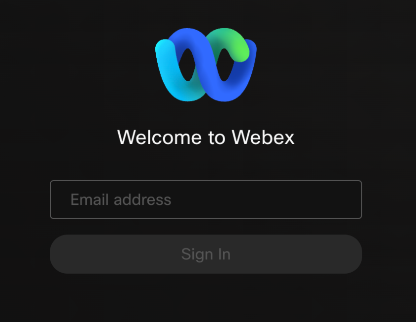
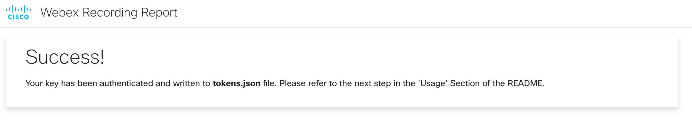
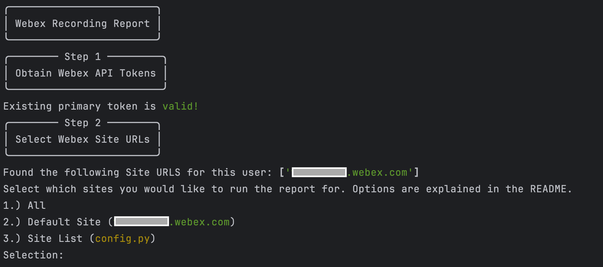
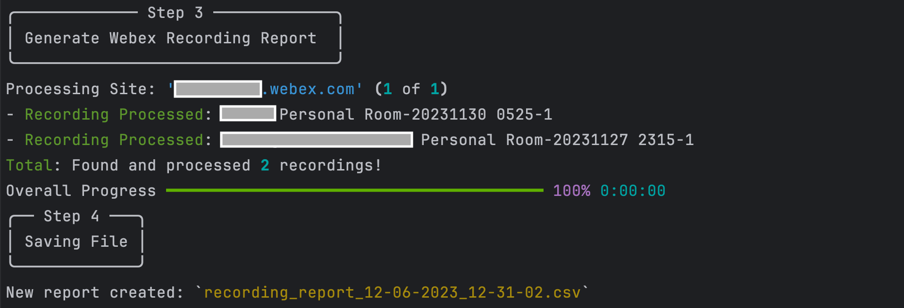
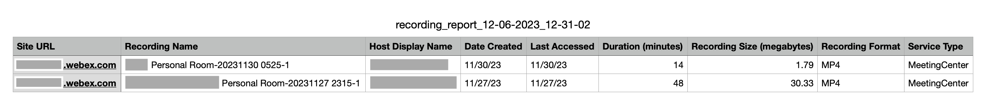

# Webex Recording Report

This script generates a Webex **Meetings** Recording Report (CSV) detailing currently stored recordings in one or more Webex Sites over a configurable time period. The report includes information about recordings such as:
* Recording Name
* Meeting Host
* Last Accessed
* Duration 
* etc.

**Note**: The default report considers recordings in the last **30** days (configurable to a value >= 0)

## Contacts
* Trevor Maco

## Solution Components
* Webex

## Prerequisites

### Webex OAuth Integration

**OAuth Integrations** are how you request permission to invoke the Webex REST API on behalf of another Webex Teams user. To do this in a secure way, the API supports the OAuth2 standard which allows third-party integrations to get a temporary access token for authenticating API calls instead of asking users for their password. 

**Note**: It's important to use a `Full Admin Account` as the underlying account for the integration. Several API calls within the script are 'admin-only' and only allow listing site-wide recordings for admins.

To register an integration with Webex Teams:
1. Log in to `developer.webex.com`
2. Click on your avatar at the top of the page and then select `My Webex Apps`
3. Click `Create a New App`
4. Click `Create an Integration` to start the wizard
5. Follow the instructions of the wizard and provide your integration's name, description, and logo
6. Add the Following Redirect URI: `http://0.0.0.0:5500/callback` (**this must be exact**)
7. Add The following scopes to the application:
   * `meeting:admin_recordings_read`
   * `meeting:admin_preferences_read`
8. After successful registration, you'll be taken to a different screen containing your integration's newly created Client ID and Client Secret
9. Copy the secret and store it safely. Please note that the Client Secret will only be shown once for security purposes

> To read more about Webex Integrations & Authorization and to find information about the different scopes, you can find information [here](https://developer.webex.com/docs/integrations)

## Installation/Configuration
1. Clone this repository with `git clone [repository name]`. To find the repository name, click the green `Code` button above the repository files. Then, the dropdown menu will show the https domain name. Click the copy button to the right of the domain name to get the value to replace [repository name] placeholder.
2. Rename the `.env_sample` file to `.env`. Rename `config_sample.py` to `config.py` (in `src` directory).
3. Add the `Webex Client Key` and `Client Secret` to `.env` from the prerequisites section.
```dotenv
WEBEX_CLIENT_ID=""
WEBEX_CLIENT_SECRET=""
```
4. In `config.py`, an optional `Site URL` list can be provided to only generate a report for those sites. A custom `Time Period` (days) can be specified as well (the default is 30 days - value must be >= 0)
```python
# A list of webex sites to get recordings from (a user must have admin access to all sites)
SITE_LIST = ["site1", "site2"]

# Time period (days) to retrieve recordings for (must be greater than 0!)
TIME_PERIOD = 30
```
5. Set up a Python virtual environment. Make sure Python 3 is installed in your environment, and if not, you may download Python [here](https://www.python.org/downloads/). Once Python 3 is installed in your environment, you can activate the virtual environment with the instructions found [here](https://docs.python.org/3/tutorial/venv.html).
6. Install the requirements with `pip3 install -r requirements.txt`

## Usage
To generate a report, there are 2 important scripts: `app.py` and `report.py`.

* `app.py`: This web app script is required to generate the Webex OAuth Tokens, and **must be run first**. Run the script with:
``` bash
$ python3 app.py
```

Once the script is running, navigate to `http://0.0.0.0:5500` (the same one configured in the Webex Integration). This will prompt a Webex Login page.



Sign in with the `Full Admin Account`. The account provided here grants the access permissions of the account to the token (in addition to the scopes defined in the integration).

You may be prompted to grant access to the integration. Once successful, a landing page with a 'Success' message is displayed:



An 'Access Token' and a 'Refresh Token' will be written to `tokens.json`. The 'Access Token' and 'Refresh Token' are valid for **14** and **90** days respectively. If the access token expires, it will automatically be refreshed if the refresh token is valid (and the refresh token's life is reset back to 90 days).

This process must only be completed once if the `report.py` script is run within 90 days of generating the tokens. Otherwise, if both tokens are expired, the process must be repeated.

* `report.py`: This script is the main report script. It relies on the tokens generated from `app.py`. Run the script with:
``` bash
$ python3 report.py
```

The script will generate the CSV report in the `reports` directory with a timestamped name like: `recording_report_[datetime].csv`. Console output and an example report are shown below:

* Console Output




* Sample Report




### LICENSE

Provided under Cisco Sample Code License, for details see [LICENSE](LICENSE.md)

### CODE_OF_CONDUCT

Our code of conduct is available [here](CODE_OF_CONDUCT.md)

### CONTRIBUTING

See our contributing guidelines [here](CONTRIBUTING.md)

#### DISCLAIMER:
<b>Please note:</b> This script is meant for demo purposes only. All tools/ scripts in this repo are released for use "AS IS" without any warranties of any kind, including, but not limited to their installation, use, or performance. Any use of these scripts and tools is at your own risk. There is no guarantee that they have been through thorough testing in a comparable environment and we are not responsible for any damage or data loss incurred with their use.
You are responsible for reviewing and testing any scripts you run thoroughly before use in any non-testing environment.